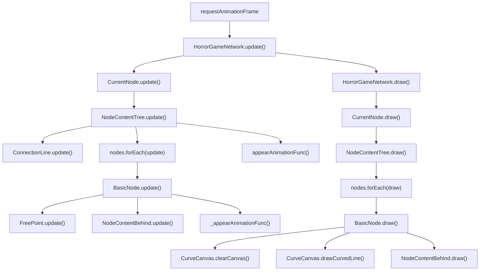
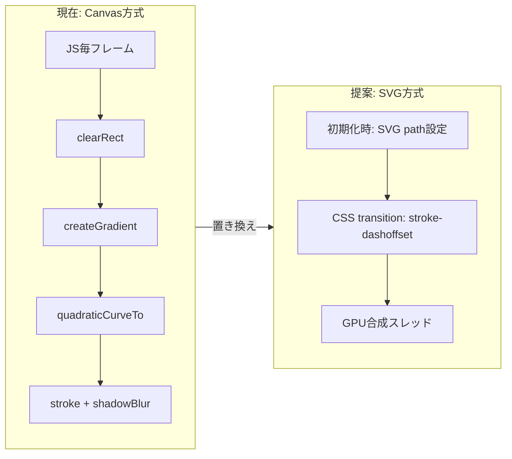

# アニメーションパフォーマンス改善プラン

## 現状のアーキテクチャ

[horror-game-network.ts](resources/ts/horror-game-network.ts) の `update()` が `requestAnimationFrame` で毎フレーム呼ばれ、全ノードの `update()` -> `draw()` を実行するメインループ方式。外部ライブラリは未使用で、全て自前実装。




## 特定されたボトルネック

### 1. [高] 常時稼働のアニメーションループ

[horror-game-network.ts](resources/ts/horror-game-network.ts) 140-154行目:

```typescript
private update(timestamp: number): void
{
    this._timestamp = timestamp;
    // ...
    this._currentNode.update();
    this.draw();
    requestAnimationFrame((timestamp) => this.update(timestamp));
}
```

アニメーションが一切動いていない静止状態でも、毎フレーム全ノードの `update()` と `draw()` が呼ばれ続けている。ページが静止している時間のほうが圧倒的に長いため、CPU/GPU使用率を常時消費している。

**改善案**: アニメーションが動作中のときだけループを回す「オンデマンド方式」に変更する。アニメーション開始時に `requestAnimationFrame` を起動し、全てのアニメーションが完了したらループを停止する。

### 2. [高] 毎フレームの `getComputedStyle` 呼び出し

[common/util.ts](resources/ts/common/util.ts) 122-140行目の `getColorFromCSSVariable()`:

```typescript
public static getColorFromCSSVariable(variableName: string): [number, number, number]
{
    const colorValue = getComputedStyle(document.body)
        .getPropertyValue(variableName)
        .trim();
    // ...
}
```

これが [curve-canvas.ts](resources/ts/node/parts/curve-canvas.ts) の `drawCurvedLine()` (128行目) と `drawBehindCurvedLine()` (169-170行目) から**毎フレーム呼ばれている**。`getComputedStyle` はブラウザのスタイル再計算を強制し、レイアウトスラッシングの原因になる。

**改善案**: CSS変数の色値をキャッシュする仕組みを導入する。コンストラクタまたはテーマ変更時に一度だけ取得し、以降はキャッシュを参照する。

### 3. [高] Canvas shadowBlur の描画コスト

[curve-canvas.ts](resources/ts/node/parts/curve-canvas.ts) 70-76行目:

```typescript
this._ctx.shadowColor = `rgba(${r}, ${g}, ${b}, 0.5)`;
this._ctx.shadowBlur = 10;
```

Canvas の `shadowBlur` は非常に高コスト。ブラウザはストローク毎にガウシアンブラーの追加レンダリングパスを実行する。ノード数が多くなると、このコストが顕著に増加する。

**改善案**:

- `shadowBlur` を削除し、CSSの `filter: drop-shadow()` でcanvas要素全体にシャドウを適用する（GPU合成で処理されるため高速）
- または、`shadowBlur` の値を小さくする（10 -> 3-5程度）
- 発光効果が不要なフレームでは `shadowBlur = 0` に設定する

### 4. [高] レイアウトを発生させるプロパティの直接操作

#### ConnectionLine の height 操作

[connection-line.ts](resources/ts/node/parts/connection-line.ts) 156行目:

```typescript
this._element.style.height = `${this._animationHeight}px`;
```

毎フレーム `style.height` を変更すると、ブラウザのレイアウト再計算（リフロー）が発生する。

**改善案**: `transform: scaleY()` を使用してGPUコンポジションで処理する。初期状態で `height` を固定し、`scaleY` で伸縮を表現する。

#### FreePoint の left/top 操作

[free-point.ts](resources/ts/node/parts/free-point.ts) 68-73行目:

```typescript
public moveOffset(x: number, y: number): FreePoint
{
    this._element.style.left = this.pos.x + x - this._halfWidth + 'px';
    this._element.style.top = this.pos.y + y - this._halfHeight + 'px';
    return this;
}
```

**改善案**: `transform: translate(x, y)` に置き換えることで、レイアウトを発生させずにGPU合成レイヤーで処理できる。

### 5. [中] `getBoundingClientRect()` の毎フレーム呼び出し

[node-content-behind.ts](resources/ts/node/parts/node-content-behind.ts) 114行目:

```typescript
const canvasRect = curveCanvas.canvas.getBoundingClientRect();
```

`getBoundingClientRect()` はレイアウト情報の取得を強制する。アニメーション中に毎フレーム呼ばれている。

**改善案**: canvasの位置が変化するタイミング（resize時など）でのみ取得してキャッシュする。

### 6. [中] イージング関数の不在

[common/util.ts](resources/ts/common/util.ts) 44-53行目:

```typescript
public static getAnimationProgress(startTime: number, duration: number): number
{
    const currentTime = (window as any).hgn.timestamp;
    const elapsedTime = currentTime - startTime;
    if (elapsedTime <= duration) {
        return elapsedTime / duration;
    }
    return 1.0;
}
```

全てのアニメーションが完全にリニア（等速）で進行する。人間の視覚にとってリニアなアニメーションは「重い・ぎこちない」と感じやすい。ease-out（始まりが速く、終わりが遅い）のようなイージングを加えることで、**同じ実時間でも体感速度が速くなる**。

**改善案**: `getAnimationProgress` にイージング関数を適用するオプションを追加する。

```typescript
public static easeOutCubic(t: number): number
{
    return 1 - Math.pow(1 - t, 3);
}
```

### 7. [中] behind-node の CSS `filter: blur(2px)`

[tree.css](resources/css/tree.css) 248行目:

```css
> .behind-node {
    filter: blur(2px);
}
```

CSS `filter: blur()` は各要素に対してGPUテクスチャを生成する。behind-nodeが複数ある場合（最大4つ）、それぞれに対してブラー処理が走る。

**改善案**: `will-change: filter` を追加してGPUレイヤーに昇格させるか、`backdrop-filter` の使用を検討する。または、初期表示時のみブラーを適用し、出現後は静的な半透明に切り替える。

### 8. [低] `(window as any).hgn.timestamp` のアクセスパターン

複数のファイルで `(window as any).hgn.timestamp` がフレーム毎に呼ばれている。型安全でないうえに、プロパティアクセスチェーンが冗長。

**改善案**: `HorrorGameNetwork.getInstance().timestamp` を使うか、update時にタイムスタンプを引数として渡すパターンに統一する。

## 追加提案: Canvas描画をSVGに置き換える

### 背景

現在のカーブ描画は `CurveCanvas` クラスがCanvas 2D APIで毎フレーム実行している。これを根本的に見直し、SVG要素 + CSSアニメーションに置き換えることで、JSのフレーム毎の描画を完全に排除し大幅な軽量化が見込める。

### 現在のカーブの特性

[curve-canvas.ts](resources/ts/node/parts/curve-canvas.ts) の `drawCurvedLine()` が描くカーブは以下の構造:

- **開始点**: 親ノードのポイント中央 `(parentNodePtWidth/2, 0)` — キャンバス上部
- **終了点**: 子ノードヘッダの接続点 `(connectionPoint.x, connectionPoint.y)` — 下方
- **制御点**: `(startPoint.x, endPoint.y)` — 「まっすぐ下に降りてから右にカーブする」L字型ベジェ曲線
- **エフェクト**: グラデーション（始点alpha → 終点alpha） + `shadowBlur: 10` による発光

出現アニメーションでは `appearProgress`（0→1）に応じてカーブが徐々に伸びていく。

### 検討した3つのアプローチ

#### A. 静的画像 + CSS clip-path

カーブの画像（PNG/WebP）を用意し、`clip-path: inset()` のCSS transitionでアニメーション。

- メリット: JSフレーム描画が完全不要。CSSアニメーションはコンポジタスレッドで動作
- デメリット: カーブの終了点がノード毎に異なるため1枚の画像では対応しづらい。`transform: scale()` で引き伸ばすと曲線の形状が崩れる

#### B. SVG path + stroke-dashoffset（推奨）

Canvasの代わりにSVG要素を配置し、`stroke-dasharray` / `stroke-dashoffset` テクニックで線が伸びていくアニメーションを制御。

- メリット: パス形状を動的に設定可能（ノード毎の座標に対応）。描画はブラウザのSVGレンダラーに委譲。グラデーション・発光もSVGフィルターで表現可能。`stroke-dashoffset` のCSS transitionはGPU合成される
- デメリット: SVGフィルターの発光効果に注意が必要（Canvas shadowBlurよりは軽量）。Behind曲線の複数描画への対応が必要

#### C. SVG path + CSS mask（ハイブリッド）

カーブ形状をSVGで動的に生成し、アニメーション部分はCSS `mask-image` の `linear-gradient` で上→下に徐々に表示。既に `node-head-text` で同様の手法が使われている。

- メリット: 既存コードと一貫性がある
- デメリット: マスクの方向がカーブに沿わない（直線的な表示になり不自然）

### 推奨: アプローチB（SVG + stroke-dashoffset）




#### 実装イメージ

HTML構造（`CurveCanvas` コンストラクタで `<canvas>` の代わりに生成）:

```html
<svg class="node-curve" viewBox="0 0 200 400">
  <defs>
    <linearGradient id="curveGrad-{nodeId}" x1="0%" y1="0%" x2="100%" y2="100%">
      <stop offset="0%" stop-color="var(--node-pt-light)" stop-opacity="1" />
      <stop offset="100%" stop-color="var(--node-pt-light)" stop-opacity="0.3" />
    </linearGradient>
    <filter id="glow-{nodeId}">
      <feGaussianBlur stdDeviation="3" result="blur" />
      <feMerge>
        <feMergeNode in="blur" />
        <feMergeNode in="SourceGraphic" />
      </feMerge>
    </filter>
  </defs>
  <path class="curve-path"
        d="M10,0 Q10,150 80,150"
        fill="none"
        stroke="url(#curveGrad-{nodeId})"
        stroke-width="2"
        filter="url(#glow-{nodeId})"
        stroke-dasharray="250"
        stroke-dashoffset="250" />
</svg>
```

CSS（[tree.css](resources/css/tree.css) に追加）:

```css
svg.node-curve {
  position: absolute;
  top: 0;
  left: 0;
  width: 200px;
  height: 400px;
  z-index: -100;
  pointer-events: none;
  contain: layout style paint;
}

svg.node-curve .curve-path {
  transition: stroke-dashoffset 0.1s linear;
}

svg.node-curve.appeared .curve-path {
  stroke-dashoffset: 0;
}
```

TypeScript（`CurveCanvas` を `CurveSvg` に置き換え）:

```typescript
export class CurveSvg
{
    private _svg: SVGSVGElement;
    private _path: SVGPathElement;
    private _pathLength: number;

    public constructor(parentNode: NodeBase)
    {
        // SVG要素の作成
        this._svg = document.createElementNS('http://www.w3.org/2000/svg', 'svg');
        this._svg.classList.add('node-curve');
        this._svg.setAttribute('viewBox', '0 0 200 400');
        // ... defs, gradient, filter の生成 ...
        
        this._path = document.createElementNS('http://www.w3.org/2000/svg', 'path');
        this._path.classList.add('curve-path');
        // ... 属性設定 ...
        
        parentNode.nodeElement.appendChild(this._svg);
    }

    // パスを設定し、全長を計算
    public setPath(startPoint: Point, endPoint: Point): void
    {
        const d = `M${startPoint.x},${startPoint.y} Q${startPoint.x},${endPoint.y} ${endPoint.x},${endPoint.y}`;
        this._path.setAttribute('d', d);
        this._pathLength = this._path.getTotalLength();
        this._path.style.strokeDasharray = `${this._pathLength}`;
        this._path.style.strokeDashoffset = `${this._pathLength}`;
    }

    // 出現: CSSトランジションに委譲（JSの毎フレーム処理不要）
    public appear(): void
    {
        this._path.style.strokeDashoffset = '0';
    }

    // 消滅
    public disappear(): void
    {
        this._path.style.strokeDashoffset = `${this._pathLength}`;
    }
}
```

#### 期待される効果

- `BasicNode.draw()` の毎フレームCanvas描画（clearRect → createGradient → quadraticCurveTo → stroke + shadowBlur）が完全に不要になる
- 出現/消滅アニメーションはCSS transitionに委譲され、GPU合成スレッドで処理
- `getColorFromCSSVariable()` の毎フレーム呼び出しも不要（SVGはCSS変数を直接参照可能）
- 結果として、ボトルネック 2, 3, 5 が同時に解消される

#### 注意点・課題

- Behind曲線（`drawBehindCurvedLine`）も同様にSVG化が必要。最大4本の曲線を持つため、SVG内に複数の `<path>` を配置する
- ホバー時のグラデーション変化（`gradientEndAlpha` の遷移）はSVGの `<stop>` 要素の `stop-opacity` をCSS transitionで制御可能
- `appearProgress` による部分描画は `stroke-dashoffset` で正確に再現可能だが、カーブに沿ったグラデーションの「伸び」は完全には再現されない（多少の見た目の差は許容）
- SVGフィルター（`feGaussianBlur`）の `stdDeviation` は小さめ（2-3）に設定し、パフォーマンスとのバランスを取る

## 改善の優先順位まとめ


| 優先度 | 改善項目                  | 期待効果                                    | 影響範囲                                                      |
| --- | --------------------- | --------------------------------------- | --------------------------------------------------------- |
| 高   | Canvas → SVG置き換え      | Canvas描画・shadowBlur・getComputedStyle全排除 | curve-canvas.ts → 新規curve-svg.ts, basic-node.ts, tree.css |
| 高   | アニメーションループのオンデマンド化    | 静止時のCPU使用率を大幅削減                         | horror-game-network.ts                                    |
| 高   | transform ベースのアニメーション | レイアウトスラッシングの排除                          | connection-line.ts, free-point.ts                         |
| 中   | イージング関数の導入            | 体感パフォーマンスの向上                            | util.ts                                                   |
| 中   | CSS blur の最適化         | GPU描画コストの削減                             | tree.css                                                  |
| 低   | timestamp アクセスパターンの改善 | 型安全性向上・軽微な速度改善                          | 複数ファイル                                                    |


※ SVG置き換えによりボトルネック 2（CSS変数キャッシュ）、3（shadowBlur）、5（getBoundingClientRect）は自動的に解消されるため、個別タスクから統合