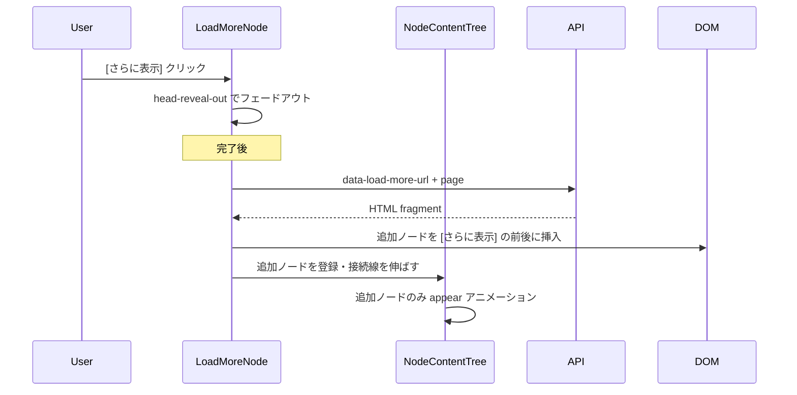

# ノード追加読み込み（さらに表示）実装プラン

## 現状の整理

- **ツリー構造**: `#current-tree-nodes` 直下に複数の `<section class="node">`（例: 検索結果、近道）が兄弟で並ぶ。追加読み込みは「そのうち1つの section の子ノードだけ」に限定し、兄弟 section はそのまま表示する。
- **接続線**: [node-content-tree.ts](resources/ts/node/parts/node-content-tree.ts) で、親の `node-head` から **lastNode** まで1本の `ConnectionLine` を描画。┣/└ は文字ではなく「線の有無」で、最後の子が「最後」なら線はそこで終わり、最後の子が「さらに表示」なら線はそのボタンまで伸びる形で表現できる。
- **LinkNode の消え方**: [node-head.ts](resources/ts/node/parts/node-head.ts) で `head-reveal-out`（mask で右→左にフェード）。[tree.css](resources/css/tree.css) の `head-reveal-out-mask` で実装。ボタンも同じ見た目で消す。

## 実装方針

### 1. 対象スコープとデータ取得

- **スコープ**: 1つの `<section class="node">` 内の `.node-content.tree` の直下の子ノード列だけを追加読み込み対象とする。兄弟の `<section class="node">` は触らない。
- **初回表示**: 最初は「先頭 N 件」＋「さらに表示」ボタン（まだ続きがあるときだけ）をサーバー側で出力。既存の `NodeContentTree.loadNodes()` で `:scope > section.node` を走査するため、**[さらに表示] も `section.node` の1つ**として置き、専用クラス（例: `load-more-node`）で識別する。

### 2. ツリーの見た目（┣/└）

- 現状の「親 head → lastNode まで1本の線」をそのまま利用する。
- **[さらに表示] があるとき**: 最後の子を「さらに表示」用の section にすると、接続線はその section まで伸びる → その1つ前のノードの「下にまだつながる」表現（┣）は、既存の接続線の描画で自然に満たせる。
- **[さらに表示] を押して追加表示したあと、まだ続きがあるとき**: 新ノードの末尾に再度「さらに表示」用 section を置く。続きがなければその section は出さない → 最後のノードで線終わり（└）。

### 3. フロントエンド（TS/CSS）

- **LoadMoreNode（新規）**
  - `section.node.load-more-node` に対応するノードクラス。`NodeContentTree.loadNodes()` の分岐で `link-node` / `link-tree-node` / `tree-node` と同様に判定し、`LoadMoreNode` を生成。
  - 見た目は「リンク風」の1行（`.node-head` + テキスト「さらに表示」）とし、スタイルは `link-node` に合わせる（右→左フェード用に `.node-head-text` に mask を効かせる）。
  - クリック時:
    1. リンク遷移は行わず、**LinkNode と同じ消え方**（`head-reveal-out` または `head-fade-out`）でボタンだけフェードアウト。
    2. フェード完了後に「追加取得」を実行（後述）。
- **追加取得と DOM 更新**
  - 取得結果（HTML 断片）を受け取り、**その section 内**で「さらに表示」の `section` の直前または直後に、新しい `section.node` 群を insert する。その後、**その section の親**（＝そのツリーを抱える TreeNode / CurrentNode）に紐づく `NodeContentTree` だけを更新する必要がある。
- **NodeContentTree の拡張**
  - **追加ノードの登録**: 新しく挿入された `section.node` だけを走査し、既存の `loadNodes()` と同様のロジックで `LinkNode` / `TreeNode` / `BasicNode` を生成し、`_nodes` の「最後の要素の手前」（従来の「さらに表示」の位置）に挿入。`LoadMoreNode` はリストから除去するか、DOM から削除するかは「サーバーが新しい [さらに表示] を返すか」に合わせる。
  - **接続線**: `resizeConnectionLine(headerPosition)` を再度呼び、`lastNode` が追加分の最後（または新たな「さらに表示」）になるよう高さを更新。既存の接続線の `changeHeight()` で伸ばす。
  - **アニメーション**: 追加されたノードだけを「いま伸びた接続線の下端付近から順に」`appear()` させる。既存の `appearAnimation()` は「接続線の `getAnimationHeight()` が伸びるにつれ、その高さ以下のノードを appear」しているので、**追加ノード用に同様の appear ロジックを1回だけ走らせる**（接続線は既に APPEARED なので、高さだけ伸ばしてから、新ノードに対して `node.appear()` を順に呼ぶ、などの形が考えられる）。既存ノードは `AppearStatus.APPEARED` のまま触らない。
- **「さらに表示」が最後の子のときの接続線**
  - 現在の `resizeConnectionLine` は `this.lastNode.nodeElement.offsetTop` で高さを決めている。`lastNode` が LoadMoreNode なら、その section の先頭まで線が伸びる。実装時に、LoadMoreNode の `offsetTop` が正しく「ボタン行」を指すようにすれば、┣ の見た目は既存の線描画で実現できる。

### 4. バックエンド（Laravel）

- **取得 API**: どの一覧を「追加読み込み」対象にするかでルートは変わる（例: 検索結果、フランチャイズ詳細のタイトル一覧、プラットフォーム詳細のタイトル一覧など）。いずれも「ページ番号 or offset と limit」を受け取り、**その部分のノード用 HTML 断片**を返す形が扱いやすい。
- **返却形式**: 同じツリーの HTML をそのまま差し込むため、**Blade の partial で「ノード列＋必要なら [さらに表示] 用 section」** を返すのがよい。`Accept` や `X-Requested-With` 等で「子ノード追加用」と判別し、`layout` を使わずにその partial だけを返す。
- **初回表示の制限**: 対象画面のコントローラで、初回は「先頭 N 件」だけ eager load し、`hasMore` のようなフラグを View に渡す。View では `@if ($hasMore)` のときだけ `section.node.load-more-node`（data 属性で `data-load-more-url` など）を出力する。

### 5. データフロー（イメージ）

### 6. ファイル変更候補（要約）

| 種別  | ファイル                                                                                                          |
| --- | ------------------------------------------------------------------------------------------------------------- |
| 新規  | `resources/ts/node/load-more-node.ts`（LoadMoreNode クラス）                                                       |
| 新規  | Blade partial（追加ノード＋オプションで「さらに表示」の HTML）                                                                      |
| 変更  | `resources/ts/node/parts/node-content-tree.ts`（loadNodes に load-more-node 分岐、追加ノード登録・接続線更新・追加分だけ appear する処理） |
| 変更  | `resources/ts/node/parts/node-head.ts` または CSS（必要なら「クリック可能だがリンクではない」用の head を LoadMoreNode 用に流用）              |
| 変更  | `resources/css/tree.css`（load-more-node の見た目を link-node に合わせる）                                                |
| 変更  | 対象画面の Blade（初回は N 件＋ hasMore で「さらに表示」section を出力）                                                             |
| 変更  | 対象の Controller（初回の件数制限、追加用エンドポイント or 既存アクションの分岐）                                                              |

### 7. 最初に適用する画面について

- 検索結果（[game/search.blade.php](resources/views/game/search.blade.php)）、フランチャイズ詳細のタイトル（[game/franchise_detail.blade.php](resources/views/game/franchise_detail.blade.php)）、プラットフォーム詳細のタイトルなど、複数候補がある。
- 実装時は **1画面に絞って**（例: フランチャイズ詳細の「タイトルラインナップ」内のノード、または検索結果のフランチャイズ列）、「さらに表示」→ 追加取得 → 同一 section 内でのみ追加表示・アニメーション」を満たすようにし、他画面は同じパターンで後から拡張するのがよい。

---

## まとめ

- 1つの `<section class="node">` 内だけを対象に、**[さらに表示] を `section.node.load-more-node` として DOM に置き、既存の loadNodes で LoadMoreNode として扱う**。
- ボタンは **LinkNode と同じ右→左フェード**で消し、その後に追加 HTML を取得して DOM に挿入し、**その section に紐づく NodeContentTree だけ**で追加ノードを登録・接続線を伸ばし・追加分のみ appear させる。
- 接続線は「最後の子 = さらに表示 or 最後のコンテンツ」のままなので、**┣/└ は既存の1本線の描画で表現できる**。
- バックエンドは「初回 N 件 + hasMore」「追加用に HTML 断片を返す API」を用意し、まずは1画面でパイプラインを整えてから他画面へ広げる。

