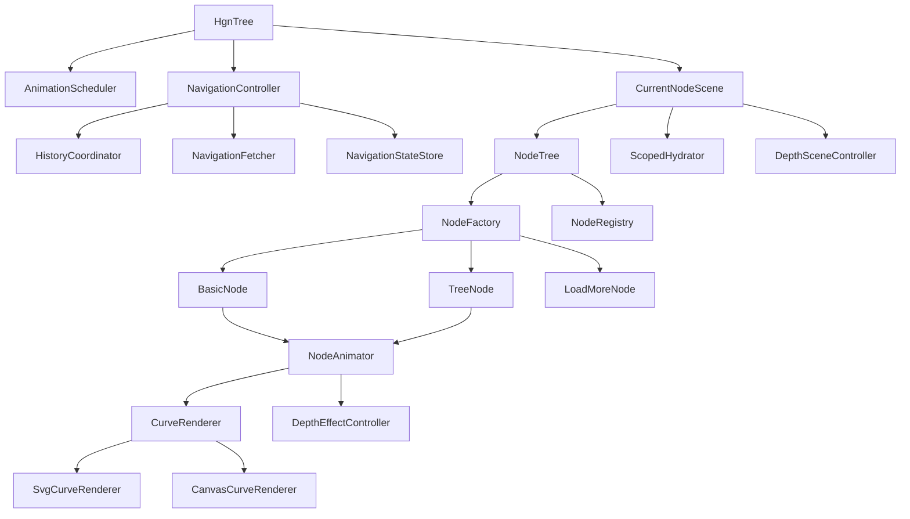

# ノード遷移 統合クラス設計書

## 目的

この設計書は、以下4つの検討結果を一つのクラス設計に統合するためのものです。

- [internal-node 根本設計変更案](./internal-node_根本設計変更案_84e11060.plan.md)
- [internal-node ノード内更新](./internal-node_ノード内更新_84e11060.plan.md)
- [アニメーションパフォーマンス改善](./アニメーションパフォーマンス改善_de917e08.plan.md)
- [Z軸アニメーション設計相談](./z軸アニメーション設計相談_6fe2754c.plan.md)

対象は主に以下の既存実装です。

- [HorrorGameNetwork](../resources/ts/horror-game-network.ts)
- [CurrentNode](../resources/ts/node/current-node.ts)
- [BasicNode](../resources/ts/node/basic-node.ts)
- [TreeNode](../resources/ts/node/tree-node.ts)
- [NodeContentTree](../resources/ts/node/parts/node-content-tree.ts)

本設計は、既存実装を参照しつつも **全面刷新を許容する前提** でまとめています。特に最上位クラスは、現行の `HorrorGameNetwork` をそのまま延命するのではなく、新しいルートクラス `HgnTree` として再定義します。

本設計の狙いは次の4点です。

- 全体更新、子ノード全更新、選択ノード内更新、外部遷移を同じナビゲーションモデルで扱う
- 更新スコープと URL 更新ポリシーを分離し、`pushState` の有無を独立指定できるようにする
- アニメーション実行基盤を軽量化し、常時 rAF と Canvas 依存を減らす
- Z軸表現を追加しつつ、ノード本文・見出し・リンクは DOM に残して SEO を維持する

---

## 設計原則

- ノード本文・見出し・リンクは **DOM を正** とする
- 接続線や視覚効果は **Renderer 層** に分離する
- ナビゲーションとアニメーションを分離し、更新スコープを型で表現する
- `CurrentNode` は「画面全体の調停役」、各ノードは「自分自身の見た目制御」に責務を絞る
- Z軸は **DOM + transform** で表現し、全文字を Canvas 化しない
- アニメーションループは **オンデマンド起動** とする

---

## 全体アーキテクチャ



---

## 主要な型

### NavigationRequest

役割:

- クリックや履歴操作から生成される「遷移要求」

想定プロパティ:

```ts
type NavigationScope = 'full' | 'children' | 'node' | 'external';

type UrlPolicy = 'push' | 'keep' | 'replace' | 'popstate';

type NavigationRequest = {
    url: string;
    scope: NavigationScope;
    sourceNodeId?: string;
    urlPolicy: UrlPolicy;
    updateCurrentNodeMeta?: boolean;
};
```

`scope` は次を意味します。

- `full`: CurrentNode のタイトル、`#current-node-content`、子ツリーを含めて全更新
- `children`: CurrentNode の `node-head` と `#current-node-content` は維持し、子ノード群のみ更新
- `node`: 選択ノード自身と、その配下の子ノードを更新
- `external`: 外部サイトへの遷移

### HTML 属性方針

アプリ独自の遷移指定は `rel` ではなく `data-*` 属性で表現する。

- `data-hgn-scope="full|children|node|external"`
- `data-hgn-url-policy="push|keep|replace"`

理由:

- `rel` は HTML 上でリンク関係を表すための標準属性であり、アプリ固有の状態指定を載せる場所としては不向き
- 未知の `rel` トークンをブラウザが即座に壊すわけではないが、意味論としては標準用途から外れやすい
- `data-*` はカスタムデータ保持のために用意された正式な仕組みなので、意図が明確

方針:

- アプリの遷移スコープや URL 更新ポリシーは `data-hgn-*` に寄せる
- `rel` は `external`、`noopener`、`noreferrer` などの標準的なリンク意味づけに限定する

### NavigationResult

役割:

- サーバー応答をクライアント適用向けに正規化した結果

想定プロパティ:

```ts
type NavigationResult = {
    updateType: 'full' | 'children' | 'node' | 'external';
    url: string;
    title: string;
    currentNodeTitle?: string;
    currentNodeContent?: string;
    nodes?: string;
    internalNodeHtml?: string;
    currentChildrenHtml?: string;
    targetNodeId?: string;
    colorState?: string;
    csrfToken?: string;
    components?: { [key: string]: any | null };
};
```

### AnimationScope

役割:

- アニメーション対象範囲を表す

```ts
type AnimationScope = 'full' | 'children' | 'node';
```

### DepthMode

役割:

- Z軸の適用レベルを表す

```ts
type DepthMode = 'none' | 'transition' | 'persistent';
```

`transition` はパターンA、`persistent` はパターンBを指します。

---

## クラス設計

## 1. アプリケーション層

### `HgnTree`

役割:

- アプリ全体の起動
- `CurrentNodeScene`、`NavigationController`、`AnimationScheduler` の組み立て
- リサイズ監視
- `popstate` の入口

責務を残すもの:

- `main` 要素の保持
- 初期状態の `history.replaceState`
- 画面全体の `resize()`

責務を外すもの:

- 毎フレーム無条件で回る `requestAnimationFrame`
- `CurrentNode` への直接的な URL 遷移指示

設計メモ:

- 現在の [HorrorGameNetwork](../resources/ts/horror-game-network.ts) を置き換える新しい最上位クラス名を `HgnTree` とする
- 現在の [HorrorGameNetwork](../resources/ts/horror-game-network.ts) は `update()` で常時 rAF を回している
- これを `AnimationScheduler.startIfNeeded()` 方式に置き換える

### `AnimationScheduler`

新規クラス。

役割:

- オンデマンドで rAF を起動・停止する
- 各フレームでアクティブなアニメータだけを更新する
- 現在時刻を一元管理する

主なメソッド:

- `requestTick()`
- `register(animatable)`
- `unregister(animatable)`
- `isIdle()`

設計メモ:

- `(window as any).hgn.timestamp` 参照を減らす
- `timestamp` は `AnimationScheduler` か `HgnTree` から安全に取得する

### `HistoryCoordinator`

新規クラス。

役割:

- `pushState` / `replaceState` / `popstate` の状態管理
- `sourceNodeId`、`scope`、`urlPolicy` の保持

主な state:

```ts
type NavigationHistoryState = {
    url: string;
    scope: 'full' | 'children' | 'node' | 'external';
    urlPolicy: 'push' | 'keep' | 'replace' | 'popstate';
    sourceNodeId?: string;
};
```

---

## 2. ナビゲーション層

### `NavigationController`

新規クラス。

役割:

- クリック起点のナビゲーション要求を受け取る
- `NavigationRequest` を解釈する
- 適切なアニメーションと fetch と画面更新を調停する

主なメソッド:

- `navigate(request: NavigationRequest): void`
- `navigateFromAnchor(anchor: HTMLAnchorElement, sourceNode: NodeType): void`
- `applyResult(result: NavigationResult): void`

責務:

- `scope === 'full'` なら全体 disappear -> fetch -> 全体 apply -> appear
- `scope === 'children'` なら CurrentNode のメタ情報は維持しつつ、子ノード群だけ disappear -> fetch -> 子ツリー apply -> appear
- `scope === 'node'` なら対象ノード disappear -> fetch -> 部分差し替え -> 該当ノードのみ appear
- `scope === 'external'` なら通常のブラウザ遷移を実行する
- `urlPolicy` は `scope` と独立して扱い、`pushState` するか URL を維持するかを別軸で決める

設計メモ:

- [BasicNode](../resources/ts/node/basic-node.ts) の `clickLink()` に分散している分岐を集約する
- [CurrentNode](../resources/ts/node/current-node.ts) の `moveNode()` 依存を薄くする
- `data-hgn-scope` と `data-hgn-url-policy` を主入力として `NavigationRequest` を組み立てる
- `rel` は標準リンク用途だけを見る

### `NavigationFetcher`

新規クラス。

役割:

- Ajax 通信
- URL に対する `a=1` や `internal_node=1` の付与
- レスポンス JSON の `NavigationResult` 化

主なメソッド:

- `fetch(request: NavigationRequest): Promise<NavigationResult>`

設計メモ:

- `full`、`children`、`node` を同じ `tree()` 応答で扱えるようにする
- `external` は fetch 対象ではなく、ブラウザ遷移に委譲する

### `NavigationStateStore`

新規クラス。

役割:

- 遷移中の一時状態を持つ
- 現在の `_nextNodeCache` と `_tmpStateData` の責務を吸収する

保持するもの:

- 最後の `NavigationRequest`
- 取得済み `NavigationResult`
- 遷移中フラグ

---

## 3. シーン層

### `CurrentNodeScene`

既存の [CurrentNode](../resources/ts/node/current-node.ts) を整理して再定義する。

役割:

- 現在表示しているシーン全体のルート
- 現在ノード本文と子ツリーの DOM 適用
- `NodeTree` の生成・破棄
- スコープ付き初期化の起点

主なメソッド:

- `applyFullResult(result: NavigationResult): void`
- `applyChildrenResult(result: NavigationResult): void`
- `applyNodeResult(result: NavigationResult): void`
- `replaceCurrentContent(result: NavigationResult): void`
- `replaceCurrentChildren(result: NavigationResult): void`
- `rebuildTree(): void`
- `getNodeById(id: string): NodeType | null`

現在から残す責務:

- `current-node-content` の更新
- `document.title` 更新
- 色状態、CSRF、コンポーネント初期化
- CurrentNode 直下の子ツリー更新

現在から外す責務:

- fetch
- `rel` 解釈
- 履歴操作

設計メモ:

- `changeNode()` は `applyFullResult()` に寄せる
- 「現状でいう `isChildOnly`」は `children` スコープに昇格させる
- `_isChanging` のような状態は `NavigationStateStore` 側に逃がす

### `ScopedHydrator`

新規クラス。

役割:

- 差し替え後 DOM の部分初期化
- `ComponentManager` とフォームイベント登録のスコープ化

主なメソッド:

- `hydrateRoot(root: HTMLElement): void`
- `disposeRoot(root?: HTMLElement): void`

設計メモ:

- 現在の `CurrentNode.setupFormEvents()` は全体志向
- `internal-node` 差し替えでは「そのノード配下だけ初期化」が必要

### `DepthSceneController`

新規クラス。

役割:

- Z軸の見え方を場面全体として制御する
- 親要素の `perspective`、深度クラス、縮小率、ぼかし量のルール管理

主なメソッド:

- `setMode(mode: DepthMode): void`
- `applyDepth(nodeElement: HTMLElement, depth: number): void`
- `focusDepth(nodeId: string): void`
- `resetDepth(): void`

設計メモ:

- SEO を守るため、ノード本体は HTML のままにする
- 見た目の奥行きは `transform`, `opacity`, `filter`, `z-index` の組み合わせで表現する
- パターンBでも「描画対象を全部 Canvas」にしない

---

## 4. ツリー層

### `NodeTree`

既存の [NodeContentTree](../resources/ts/node/parts/node-content-tree.ts) を中核に再定義する。

役割:

- 子ノード配列の保持
- ノード生成
- 接続線の管理
- 部分差し替え
- ノード検索
- CurrentNode 直下の子ツリー全更新

主なメソッド:

- `loadNodes(parentNode: TreeNodeInterface): void`
- `disposeNodes(): void`
- `getNodeById(id: string): NodeType | null`
- `replaceChildren(html: string): NodeType[]`
- `replaceNodeById(nodeId: string, html: string): NodeType | null`
- `replaceLoadMoreWithNodes(loadMoreNode: LoadMoreNode, html: string): void`

新規で強く持たせる責務:

- 部分更新の正規ルート
- 差し替え後ノード参照の返却
- 接続線リサイズの再同期

設計メモ:

- 現在すでに `createNodeFromElement()` と `replaceLoadMoreWithNodes()` があり、差分更新の土台はある
- `internal-node` はこの方向で統一するのが自然

### `NodeFactory`

新規クラスとして切り出し推奨。

役割:

- `section.node` の class から適切な Node クラスを返す

主なメソッド:

- `create(nodeElement: HTMLElement, parentNode: TreeNodeInterface): NodeType`

設計メモ:

- 現在は [NodeContentTree](../resources/ts/node/parts/node-content-tree.ts) 内の `createNodeFromElement()` が担当
- 単体テストしやすくするため分離したい
- `LinkNode` のような「クリック専用ノード」は廃止し、クリック可能かどうかは DOM 内の `<a>` の有無で決める

### `NodeRegistry`

新規クラス。

役割:

- node id とインスタンスの対応を管理する
- `getNodeById` を配列走査ベースから段階的に改善する

主なメソッド:

- `register(node: NodeType): void`
- `unregister(nodeId: string): void`
- `find(nodeId: string): NodeType | null`

設計メモ:

- 初期段階では `NodeTree` 内部の map でもよい
- 深いネストでの `getNodeById()` コストと責務分散を抑えられる

---

## 5. ノード層

### `NodeBase`

役割:

- DOM 参照の基本保持
- 共通の appear/disappear 状態
- `resize`, `draw`, `dispose` の基底契約
- `node-head` と `node-content` 内のアンカー検出の基底契約

方針:

- ここにはナビゲーション知識を持たせない

### `BasicNode`

役割:

- 単一ノードの表示・非表示アニメーション
- 自ノード内リンクのクリック委譲
- 自ノード内フォーム送信の入口

残す責務:

- 自身のヘッダ、本文、behind 表現の表示制御

減らす責務:

- 遷移種別の分岐
- URL 遷移先決定

主な公開メソッド:

- `appear(options?)`
- `disappear(options?)`
- `disappearSolo(onComplete?)`
- `bindInteractions()`
- `getNavigableAnchors(): HTMLAnchorElement[]`

設計メモ:

- 既存の `disappearOnlyThisNode()` は `disappearSolo()` に寄せる
- `clickLink()` は `NavigationController.navigateFromAnchor()` 呼び出しだけに寄せる
- `node-head` でしか遷移できない特別な Node は作らず、`node-head` でも `node-content` でも `<a>` があれば同じ経路で扱う
- アンカー要素からは `dataset.hgnScope` / `dataset.hgnUrlPolicy` を読む

### `TreeNode`

役割:

- 子ツリーを持つノード
- `NodeTree` と自身のアニメーション接続

主な公開メソッド:

- `appear(isFast?: boolean): void`
- `disappearFull(): void`
- `disappearSolo(onComplete?: () => void): void`
- `getNodeById(id: string): NodeType | null`

設計メモ:

- `prepareDisappear(homewardNode)` と `homewardDisappear()` は full 更新専用に寄せる
- `internal-node` では帰路アニメーションを通さない

### `LoadMoreNode`

役割:

- 「さらに表示」の部分追加専用ノード

方針:

- `NodeTree.replaceLoadMoreWithNodes()` を使う差分追加系ノードとして維持
- `internal-node` と同じ「差分反映の流れ」に乗せる

---

## 6. アニメーション層

### `NodeAnimator`

新規クラス。

役割:

- ノード単位の appear/disappear の進行管理
- `BasicNode` と `TreeNode` から時間計算・ easing・ transform 更新を切り離す

主なメソッド:

- `playAppear(target, options): Promise<void>`
- `playDisappear(target, options): Promise<void>`
- `playHomewardDisappear(target): Promise<void>`

設計メモ:

- 既存の `_appearAnimationFunc` 方式を薄くし、状態遷移を見通しやすくする
- `AnimationScheduler` と連携する

### `DepthEffectController`

新規クラス。

役割:

- Z軸の見た目ルールをノード単位に適用する

主なメソッド:

- `setDepth(element: HTMLElement, depth: number): void`
- `setFocused(element: HTMLElement): void`
- `setBackgroundHint(element: HTMLElement): void`

適用ルール例:

- depth が深いほど `scale` を小さくする
- depth が深いほど `opacity` を下げる
- depth が深いほど `blur` を強める
- モバイル時は blur を弱くして可読性を落としすぎない

設計メモ:

- 「奥に何かがある」と分かれば十分、という合意に沿う
- ただし `prefers-reduced-motion` では Z 移動を抑制する

### `CurveRenderer`

インターフェース化推奨。

役割:

- 接続線の描画実装を抽象化する

```ts
interface CurveRenderer
{
    resize(): void;
    drawCurve(start: Point, end: Point, progress: number): void;
    drawBehindCurve(start: Point, end: Point, depth: number, progress: number): void;
    clear(): void;
}
```

### `SvgCurveRenderer`

推奨実装。

役割:

- SVG + CSS で接続線アニメーションを表現する

採用理由:

- 毎フレームの Canvas 再描画を減らせる
- `stroke-dashoffset` ベースに寄せやすい
- 色キャッシュや blur 最適化がしやすい

### `CanvasCurveRenderer`

移行期間用の互換実装。

役割:

- 現在の [CurveCanvas](../resources/ts/node/parts/curve-canvas.ts) の互換層

方針:

- すぐには消さず、インターフェースに合わせて段階的に置換する

---

## 7. 推奨ファイル配置

```text
resources/ts/
  horror-game-network.ts
  animation/
    animation-scheduler.ts
    node-animator.ts
    depth-effect-controller.ts
  navigation/
    navigation-controller.ts
    navigation-fetcher.ts
    navigation-state-store.ts
    history-coordinator.ts
    types.ts
  node/
    current-node.ts
    basic-node.ts
    tree-node.ts
    load-more-node.ts
    node-factory.ts
    node-registry.ts
    parts/
      node-content-tree.ts
      connection-line.ts
      renderers/
        curve-renderer.ts
        svg-curve-renderer.ts
        canvas-curve-renderer.ts
  hydrate/
    scoped-hydrator.ts
```

---

## 8. 処理フロー

### 全体更新

1. ノード内リンククリック
2. `NavigationController.navigateFromAnchor()`
3. `scope: 'full'` の `NavigationRequest` を生成
4. `CurrentNodeScene` に全体 disappear を依頼
5. `NavigationFetcher.fetch()`
6. `CurrentNodeScene.applyFullResult()`
7. `NodeTree.loadNodes()`
8. `ScopedHydrator.hydrateRoot()`
9. appear

### 子ノード全更新

1. CurrentNode 配下のリンククリック
2. `NavigationController.navigateFromAnchor()`
3. `scope: 'children'` の `NavigationRequest` を生成
4. CurrentNode の `node-head` と `#current-node-content` は維持したまま、子ツリーだけ disappear
5. `NavigationFetcher.fetch()`
6. `CurrentNodeScene.applyChildrenResult()`
7. `NodeTree.replaceChildren()`
8. 子ツリーのみ appear

### 選択ノード内更新

1. `data-hgn-scope="node"` リンククリック
2. `NavigationController.navigateFromAnchor()`
3. `scope: 'node'` と `sourceNodeId` を付与
4. 対象ノードのみ `disappearSolo()`
5. `NavigationFetcher.fetch()`
6. `NodeTree.replaceNodeById()`
7. 返却された新ノードのみ `appear()`
8. そのノード配下だけ `ScopedHydrator.hydrateRoot()`

### 外部遷移

1. 外部リンククリック
2. `NavigationController.navigateFromAnchor()`
3. `scope: 'external'` の `NavigationRequest` を生成
4. 標準のブラウザ遷移を実行

### Z軸付き遷移

1. `DepthSceneController.setMode('persistent')`
2. `DepthEffectController` が各ノードに depth を適用
3. フォーカス遷移時に対象 depth を手前へ補正
4. 接続線は `CurveRenderer` が見た目だけ同期

---

## 9. SEO と Z軸の扱い

方針は明確です。

- ノードのテキスト、見出し、リンク、フォームは DOM のままにする
- Z軸は `transform: translateZ()`、`scale()`、`opacity`、`filter` で表現する
- 接続線のみ Renderer 層で描画する
- 全ノード Canvas 描画にはしない

この方針により:

- 検索エンジンは本文やリンクを通常の HTML として扱える
- スマホでの縦スクロール構造を維持できる
- エースコンバット7寄りの奥行き演出を導入できる

参考:

- [『エースコンバット7 スカイズ・アンノウン』～ 作中世界の"OS"を表現するGUI ～](https://cgworld.jp/feature/201908-gg2019-ace7.html)

---

## 10. 段階的な移行順序

### Phase 1

- `NavigationRequest` / `NavigationResult` / `NavigationController` を導入
- `CurrentNode` の fetch 責務を外へ出す
- `full` / `children` / `node` / `external` を同じナビゲーションモデルに乗せる
- `pushState` と URL 維持を `urlPolicy` として独立させる

### Phase 2

- `NodeTree.replaceNodeById()` を正式導入
- `NodeTree.replaceChildren()` を導入
- `ScopedHydrator` を導入
- `HistoryCoordinator` で `sourceNodeId` を扱う

### Phase 3

- `AnimationScheduler` を導入し、常時 rAF を停止
- `NodeAnimator` を追加し、ノードの時間制御を整理
- `FreePoint`、`ConnectionLine` を transform ベースへ寄せる

### Phase 4

- `CurveRenderer` を導入
- `CanvasCurveRenderer` から `SvgCurveRenderer` へ段階移行
- 色キャッシュと blur 最適化を実施

### Phase 5

- `DepthSceneController` / `DepthEffectController` を追加
- パターンAで Z 演出を試す
- 問題なければパターンBの persistent depth を限定導入する

---

## 11. この設計での判断

- **採用**: DOM を正としたままの Z軸表現
- **採用**: 全体更新、子ノード全更新、選択ノード更新、外部遷移の統一ナビゲーションモデル
- **採用**: `pushState` と URL 維持を遷移スコープと独立した指定にする
- **採用**: NodeTree による差分更新
- **採用**: オンデマンド rAF
- **推奨**: 接続線は SVG へ移行
- **維持**: 縦に伸びるレイアウト、横スクロールなし
- **非推奨**: ノード本文を全部 Canvas に描く構成
- **採用**: `LinkNode` は廃止し、どの Node でも `<a>` があれば同じ遷移経路に乗せる

---

## 12. 補足

この設計は、既存クラスを温存する前提の再編案ではなく、**必要なら全面刷新してよい設計案** です。既存の [HorrorGameNetwork](../resources/ts/horror-game-network.ts)、[CurrentNode](../resources/ts/node/current-node.ts)、[NodeContentTree](../resources/ts/node/parts/node-content-tree.ts) は、責務の棚卸しと移行順序を考えるための参照元として扱います。実装時は、`HgnTree` を新しいルートに据えたうえで、既存コードの流用よりも責務分離と将来拡張性を優先して構いません。
