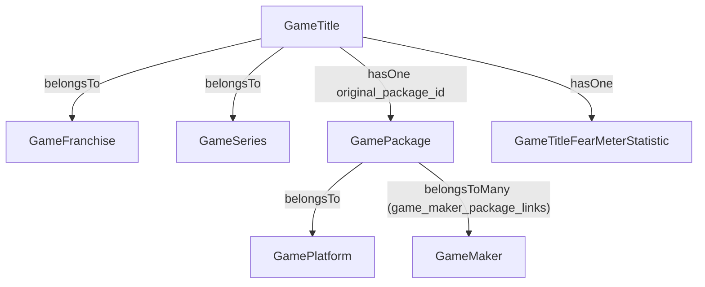

# lineup() 検索機能強化 実装案

## 現状の問題点




プラットフォーム・メーカーで絞り込むには `game_titles → game_packages → game_platforms/makers` と複数テーブルをJOINする必要があり、データ量増加で重くなる。

## 推奨案: Meilisearch インデックス拡張

**Meilisearchがroaring bitmapベースの転置インデックスでfilterを処理するため、JOINなしに高速フィルタが可能。テキスト検索とフィルタの組み合わせも1クエリで対応できる。**

追加インフラ不要・既存の構成を最大限活用できるため、今回の要件にはこれが最適。

MongoDBはスキーマ変更の柔軟性、Redisはキャッシュとして有用だが、今回はMeilisearch拡張で十分なため不要。

## 実装内容

### 1. `toSearchableArray()` 拡張

`**[app/Models/GameTitle.php](app/Models/GameTitle.php)`**

追加フィールド:

- `platform_ids` (int[]) — titlesに紐づく全packageのplatform_id
- `maker_ids` (int[]) — 全packageのmaker_id（多対多）
- `fear_meter` (int|null) — `fearMeterStatistic->fear_meter`
- `first_release_int` (int) — 既存カラム、インデックスに追加

Eager Loadが必要:

```php
public function toSearchableArray(): array
{
    $this->loadMissing(['packages.platform', 'packages.makers', 'fearMeterStatistic']);
    // ...
    'platform_ids' => $this->packages->pluck('game_platform_id')->unique()->values()->toArray(),
    'maker_ids'    => $this->packages->flatMap->makers->pluck('id')->unique()->values()->toArray(),
    'fear_meter'   => $this->fearMeterStatistic?->fear_meter,
    'first_release_int' => $this->first_release_int,
```

### 2. `config/scout.php` 更新

`**[config/scout.php](config/scout.php)**`

```php
'game_titles' => [
    'searchableAttributes' => ['name', 'phonetic', 'search_synonyms'],
    'filterableAttributes' => ['platform_ids', 'maker_ids', 'fear_meter', 'first_release_int'],
],
```

### 3. `GameController::lineup()` 更新

`**[app/Http/Controllers/GameController.php](app/Http/Controllers/GameController.php)**`

受け取るパラメータ:

- `text` — 既存
- `platform_id` (int) — プラットフォームID
- `maker_id` (int) — メーカーID（オートコンプリートで取得）
- `fear_meter_min` (int) — 怖さメーターの下限 (0〜4)
- `fear_meter_max` (int) — 怖さメーターの上限 (0〜4)
- `release_from` (int) — first_release_int の下限（例: 20200101）
- `release_to` (int) — first_release_int の上限

怖さメーターは範囲指定（連続した値のみ対応）:

- 例: min=0, max=2 → 「0〜2」、min=3, max=3 → 「3だけ」、min=3, max=4 → 「3〜4」
- 飛び番（1と3など非連続の複数選択）は非対応

処理フロー変更:

- テキストなし・フィルタなし → 現状通りDB（`last_title_update_at`降順）
- テキストあり **または** フィルタあり → Meilisearch（filter構文を組み立てて渡す）

Meilisearchのfilter文字列例:

```
platform_ids = 3 AND maker_ids = 12 AND fear_meter >= 2 AND fear_meter <= 4 AND first_release_int >= 20200101
```

### 4. メーカーオートコンプリートAPI 新設

**新規: `[app/Http/Controllers/Api/GameMakerController.php](app/Http/Controllers/Api/GameMakerController.php)`**

- `GET /api/game/maker/suggest?q=xxx`
- `GameMaker`の`name`・`phonetic`でLIKE検索（+ `GameMakerSynonym`も対象）
- 件数が少ないのでMariaDBで十分
- `routes/api.php` にルート追加

### 5. プラットフォーム一覧の取得

- プラットフォーム数は少ないため、APIではなくBladeに一覧を埋め込む
- `GameController::lineup()` でプラットフォーム一覧をviewに渡す

### 6. `lineup.blade.php` フィルタUI追加

`**[resources/views/game/lineup.blade.php](resources/views/game/lineup.blade.php)**`

- プラットフォーム: `<select>`
- メーカー: テキスト入力 + Ajaxオートコンプリート（`/api/game/maker/suggest`）
- 怖さメーター: 0〜4の範囲スライダーまたはmin/maxセレクト（「3だけ」「0〜2」「3〜4」など連続範囲で指定）
- 発売時期: 年の範囲入力 or セレクト

### 7. インデックス再構築（コマンド）

```bash
php artisan scout:import "App\Models\GameTitle"
```

## その他の選択肢まとめ


| 案                   | 概要                                                                 | 向いているケース             |
| ------------------- | ------------------------------------------------------------------ | -------------------- |
| MariaDB デノーマライズテーブル | `game_title_search_indexes` を作りJSONカラムに platform_ids/maker_ids を保存 | Meilisearchを使いたくない場合 |
| MongoDB             | タイトル情報をドキュメントとして非正規化保存                                             | スキーマ変更が頻繁・集計が多い場合    |
| Redis               | フィルタ結果のキャッシュ                                                       | 同一条件の検索が多い場合の補完用途    |
| Typesense           | Meilisearchの代替全文検索エンジン                                             | 今回は不要                |


